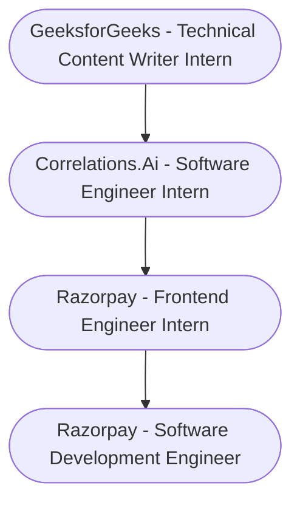

# Hi 👋 My name is Divyansh Singh

### Software Development Engineer @Razorpay

Hey folks, I'm just a skinny guy with earbuds always plugged in my ears doing some weird steps while listening to music most of time. So currently I'm working as a SDE at Razorpay in Issuer Tokenisation Team. Have had experience in working in multiple teams and on multiple projects in the last 14 months. My past work was mostly focussed on frontend related stuff but will now be expanding my horizons just to have a better glimpse of entire flow of any project. Feel free to ping me on LinkedIn (Link attached below), always happy to build more connections.

- 🌍  I'm based in Prayagraj, Uttar Pradesh, India.
- 🖥️  See my portfolio at [http://rgndunes-v3.web.app/.](http://rgndunes-v3.web.app/)
- 📄  View my [Resume](./Resume.pdf).
- ✉️  You can contact me at [LinkedIn.](https://www.linkedin.com/in/rgndunes)
- 🚀  I'm currently working on [on a solution that provides tokenisation solution for different banks as per the new RBI Guidelines.](http://rbi.org.in/Scripts/NotificationUser.aspx?Id=12159&Mode=0)
- 🧠  I'm learning Typescript.
- ⚡  A big Marvel fan.

### Skills

<pre>
                                       
</pre>

### Trophies

### Badges (My GitHub Stats)

 
<!-- 
### Top Repositories

       -->

 

<h3> Support Me</h3>

---
